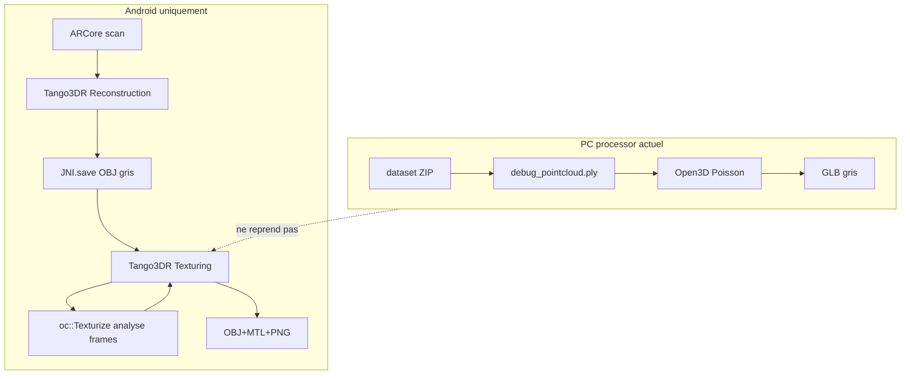

# Audit pipeline Android — export modèle texturé final

Date : 2026-05-19  
Objectif : comprendre comment l’app produisait un **OBJ + MTL + textures PNG** coloré, pour le reproduire sur Windows.

---

## Chaîne complète (dataset brut → fichier final)

```
Scan live (ARCore)
  → Tango3DR reconstruction voxel (TangoScan, pendant le scan)
  → dataset/ : NNNNNNNN.jpg, .mat, .tms, .pcl, state.txt, distortion.txt, rotation.txt

Sauvegarde / post-traitement (ScanProcessingService)
  → JNI.save(temp/processing_input.obj)     mesh géométrique depuis Tango3DR
  → JNI.texturize(input, output, poisson, analyseImages)
  → Exporter.export(output.obj)             copie vers dossier utilisateur
  → TextureExportValidator                  vérifie vt, mtl, map_Kd, PNG
```

Le ZIP « export PC » contient le **dataset brut** (étape avant `JNI.texturize`). Le PC processor actuel ne rejoue pas cette étape.

---

## Réponses aux 8 questions

### 1. Quelle fonction lance l’analyse des images ?

| Couche | Fonction | Fichier |
|--------|----------|---------|
| Java | `ScanProcessingService.runSaveTexturedScan()` / `runPostprocess()` | `scanner/.../ScanProcessingService.java` |
| JNI | `JNI.texturize(...)` | `JNI.java` |
| C++ | `App::Texturize(input, output, poisson, twoPass)` | `scanner/app/src/main/jni/app.cc` |
| Analyse frames | `oc::Texturize::Process(dataset, model, false)` | `common/postproc/texturize.cc` |

Quand `analyseImages == true` (`twoPass == true` dans `App::Texturize`) :

1. Premier passage Tango (`texturize.Process(output, true, false)`)
2. **`oc::Texturize::Process`** — parcourt les JPG, détection de bords (Canny), score par frame, `RemoveBadFrames()`
3. `texturize.ApplyFrames(dataset, frames)` — upload des frames sélectionnées
4. Passage final Tango (`texturize.Process(output, true, poisson)`)

L’analyse d’images **ne peint pas les textures finales** : elle **sélectionne** quelles photos envoyer à Tango3DR.

---

### 2. Quelle fonction génère les UV ?

**`Tango3DR_getTexturedMesh`** dans `TangoTexturize::Process()` :

```182:200:common/tango/texturize.cc
    void TangoTexturize::Process(std::string filename, bool verbose, bool poisson) {
        ...
        ret = Tango3DR_getTexturedMesh(context, &mesh);
        ...
        ret = Tango3DR_Mesh_saveToObj(&mesh, filename.c_str());
```

Événement UI : `"UNWRAP"`.  
`oc::Texturize` utilise des UV **déjà présents** sur le mesh (`hasUv` dans `LoadModel`) — il ne crée pas l’atlas UV global.

Le contexte UV est créé par **`Tango3DR_TexturingContext_create`** (`CreateContext`) après chargement du mesh OBJ.

---

### 3. Quelle fonction crée les textures ?

| Étape | Fonction | Rôle |
|-------|----------|------|
| Projection photos | `Tango3DR_updateTexture` | `TangoTexturize::ApplyFrames` — chaque JPG → atlas Tango |
| Finition / bavelures | `oc::Texturize::WriteTextures`, `AddTextureBevel` | post-traitement sur images déjà dans le mesh (secondaire) |
| Export PNG | `Tango3DR_Mesh_saveToObj` + `Image::Write` | écrit OBJ, MTL, fichiers `map_Kd` |

Paramètres atlas (dans `CreateContext`) : `texture_size` (2048 par défaut), `max_num_textures`, `mesh_simplification_factor`.

---

### 4. Quelle fonction écrit OBJ / MTL / textures ?

| Fonction | Fichier |
|----------|---------|
| **`Tango3DR_Mesh_saveToObj`** | API Tango3DR (appelée depuis `TangoTexturize::Process`) |
| **`File3d::WriteModel`** | `common/data/file3d.cc` — OBJ/MTL manuel pour saves intermédiaires |
| **`Exporter.export` (Java)** | `scanner/.../Exporter.java` — copie vers stockage utilisateur |

Validation finale : **`TextureExportValidator.validate`** — exige lignes `vt`, `mtllib`, `usemtl`, `map_Kd` et fichiers PNG existants.

---

### 5. Quel rôle joue `tango_3d_reconstruction` ?

Bibliothèque **Google Project Tango 3D Reconstruction** (Apache 2.0 header). Utilisée pour :

| Usage | API / module |
|-------|----------------|
| Reconstruction live | `Tango3DR_ReconstructionContext`, `Tango3DR_updateFromPointCloud` — `common/tango/scan.cc` |
| Texturing | `Tango3DR_TexturingContext`, `updateTexture`, `getTexturedMesh` — `common/tango/texturize.cc` |
| I/O mesh | `Tango3DR_Mesh_loadFromObj`, `Tango3DR_Mesh_saveToObj` |

Sans cette lib : **pas d’UV atlas, pas de projection texture multi-vues au qualité Android**.

---

### 6. Est-ce que cette lib existe pour Windows dans le repo ?

**Non.**

Contenu réel de `third_party/tango_3d_reconstruction/` :

- `include/tango_3d_reconstruction_api.h` (API C)
- `Android.mk` (PREBUILT shared library)

`Android.mk` référence uniquement :

- `lib/armeabi-v7a/libtango_3d_reconstruction.so`
- `lib/arm64-v8a/libtango_3d_reconstruction.so`

**Aucun** `.dll`, `.lib`, `.a` Windows dans le dépôt. Les binaires ARM ne sont pas versionnés ici (présents seulement après build Android local).

---

### 7. Peut-on compiler ce pipeline sur Windows tel quel ?

**Non**, pas le pipeline texturé complet.

| Composant | Windows |
|-----------|---------|
| `common/postproc/texturize.cc` | Compilable (OpenCV, dataset, file3d) — voir `dataset_extractor/CMakeLists.txt` |
| `common/tango/texturize.cc` | **Ne compile pas** sans lier `libtango_3d_reconstruction` |
| `common/tango/scan.cc` | Idem (reconstruction) |
| `scanner/app/src/main/jni/app.cc` | Android JNI + ARCore |
| `dataset_extractor` | Build desktop **sans** Tango3DR ; `app.cpp` appelle `Texturize::Process` seul → **incomplet** (pas d’UV Tango) |

---

### 8. Si non, quelle partie bloque exactement ?

1. **Binaire Tango3DR** — précompilé Android ARM uniquement, pas de port Windows officiel dans le repo.
2. **`TangoTexturize`** — 100 % des appels UV + texture passent par Tango3DR.
3. **Reconstruction mesh** — `TangoScan::Export()` lit les maillages voxel Tango3DR ; le PC processor utilise Open3D Poisson sur PLY (géométrie différente, sans textures).
4. **Scan live** — ARCore + JNI ; non disponible sur PC pour rejouer le même mesh d’entrée.

---

## Schéma des dépendances



---

## Fichiers clés (référence rapide)

| Fichier | Rôle |
|---------|------|
| `ScanProcessingService.java:347-380` | Orchestration save + texturize + export |
| `app.cc:939-1024` | `App::Texturize` deux passes |
| `common/tango/texturize.cc` | Tango3DR texturing |
| `common/postproc/texturize.cc` | Sélection frames + projection texels |
| `common/tango/scan.cc` | Reconstruction voxel |
| `common/data/file3d.cc` | Lecture/écriture OBJ/MTL |
| `TextureExportValidator.java` | Critères « export texturé valide » |
| `dataset_extractor/app.cpp` | Outil desktop partiel (sans Tango) |
