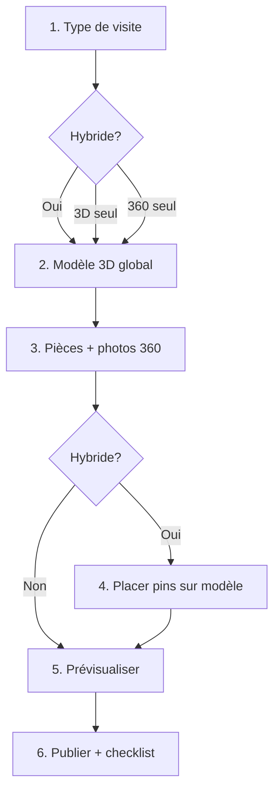

# Audit UX — Admin visite hybride 3D + 360

Date : mai 2026  
Projet : Visitevirutel (`components/admin/`)

---

## 1. Formulaire propriété actuel (`property-form.tsx`)

### Structure
- Colonne gauche : métadonnées (nom, adresse, ville, prix, description, statut) + section hybride.
- Colonne droite : uploads (couverture, modèle 3D) + bouton unique « Créer / Modifier ».

### Problèmes
| Élément | Problème |
|---------|----------|
| Layout 2 colonnes | Le modèle 3D est à droite, la config hybride à gauche — l’utilisateur ne suit pas un ordre logique. |
| Un seul bouton de sauvegarde | Tout est sauvé d’un coup en fin de formulaire ; perte de travail possible. |
| Statut mélangé | « Brouillon / Publié » noyé dans les champs généraux, pas dans une étape de publication. |
| Pas d’étapes | Aucune progression visible ; charge cognitive élevée. |

---

## 2. Section hybride actuelle (`hybrid-property-section.tsx`)

### Comportement
- Sélecteur `visitType` (3 options) en haut d’un bloc beige.
- Si `PANORAMA_360` ou `HYBRID_3D_360` : liste de scènes avec nom + file input + URL brute affichée.
- Si `HYBRID_3D_360` : liste de hotspots séparée du viewer, avec champs **X / Y / Z** toujours visibles.

### Ce qui est confus
1. **Hotspots vs pièces** : l’utilisateur doit créer une pièce ET un hotspot ET les relier manuellement via un select « Panorama cible ».
2. **Double action « Placer » et « Replacer »** : deux boutons quasi identiques sans guide pas-à-pas.
3. **Coordonnées x/y/z** : affichées par défaut ; vocabulaire 3D incompréhensible pour un agent immobilier.
4. **URL du fichier** : `break-all text-xs` au lieu d’une miniature ou d’un statut visuel.
5. **Pas de modèles de pièces** : « Pièce 1 », « Pièce 2 » au lieu de Salon / Cuisine / Chambre.
6. **Feedback placement** : message technique `Position enregistrée : x=… y=… z=…`.

### Ce qui est trop technique
- Champs numériques X, Y, Z.
- Texte « mesh », « équirectangulaire » sans explication visuelle.
- Association `panoramaSceneId` invisible pour l’utilisateur.
- ZIP : message amber mais pas d’alternative guidée.

### Ce qui doit être automatisé
- Création du hotspot quand on place un pin pour une pièce (label = nom de pièce, `panoramaSceneId` = scène).
- Validation visuelle : pièce avec image / sans image ; pièce avec pin / sans pin.
- Checklist avant publication.
- Mapping erreurs API → messages français simples.

### Ce qui doit être caché (mode avancé)
- Coordonnées x/y/z (accordéon « Coordonnées avancées »).
- URL brute des fichiers (remplacer par statut + miniature).
- Édition manuelle du label hotspot si = nom de pièce (optionnel en avancé).

---

## 3. Upload modèle 3D

### Actuel
- Input file dans colonne droite, formats multiples (.glb, .obj, .zip…).
- Texte technique sur OBJ+MTL.
- Affichage URL + type entre parenthèses.

### Manques
- Pas d’aperçu 3D dans le flux upload (sauf si l’utilisateur scroll jusqu’aux hotspots).
- Pas de taille fichier / statut « modèle chargé » clair.
- ZIP : placement désactivé sans workflow alternatif clair.

### Workflow idéal (étape 2)
- Zone drag-and-drop ou bouton unique « Ajouter le modèle 3D ».
- Badge : chargé / en attente.
- Mini aperçu 3D (viewer sans placement).
- Bouton « Continuer » désactivé tant que pas de modèle.

---

## 4. Upload panoramas

### Actuel
- File input par carte de scène.
- Message « Upload en cours… » / « Image panorama requise ».

### Manques
- Pas de miniature de l’image 360.
- Pas de boutons « Remplacer » / « Supprimer » explicites.
- Pas de cartes types Salon, Cuisine, etc.

### Workflow idéal (étape 3)
- Cartes avec nom, upload, miniature, validation verte « Image 360 ajoutée ».
- Bouton « Ajouter une pièce » avec presets.

---

## 5. Ajout hotspots

### Actuel
- Bouton « Ajouter un pin » → hotspot générique « Nouveau pin ».
- Placement via `HotspotPlacementViewer` (clic mesh) — **techniquement bon**.
- Mais workflow inversé : on crée le pin avant de choisir la pièce.

### Workflow idéal (étape 4)
1. Liste des pièces à gauche (vert = pin placé, orange = à faire).
2. Clic sur « Salon » → mode placement actif.
3. Clic sur le modèle → pin créé/mis à jour, lié à Salon.
4. Passer à la pièce suivante automatiquement (optionnel).

---

## 6. Prévisualisation

### Actuel
- Aucune prévisualisation admin avant sauvegarde + lien public après submit.
- L’utilisateur doit publier puis ouvrir `/visite/{slug}`.

### Workflow idéal (étape 5)
- `HybridVisitViewer` embarqué dans l’admin : même rendu que le public.
- Bouton « Prévisualiser la visite » accessible avant publication.

---

## 7. Sauvegarde

### Actuel
- Submit unique ; `router.refresh()` après succès.
- Erreurs Zod brutes possibles (`error.message`).

### Risques
- Fermeture onglet = perte des uploads non soumis (scènes/hotspots en state React seulement).
- `replaceHybridData` : tout recrée à chaque save — pas de problème UX si save explicite.

### Workflow idéal
- « Enregistrer et continuer » par étape (édition).
- Indicateur : Enregistrement… / Sauvegardé / Erreur.
- Checklist étape 6 avant « Publier la visite ».

---

## 8. Erreurs possibles

| Erreur technique | Cause | Message cible |
|------------------|-------|---------------|
| `panoramaSceneId` manquant | Hotspot sans scène | Choisissez la photo 360 liée à ce pin. |
| `invalid x` / coords | Saisie manuelle invalide | Placez le pin sur le modèle 3D. |
| `upload failed` | Fichier trop lourd / réseau | Image non envoyée — JPG/PNG plus léger. |
| `Le modèle 3D est obligatoire` | Pas d’upload | Ajoutez d’abord votre modèle 3D (.glb recommandé). |
| ZIP + placement | Pas de viewer mesh | Utilisez un fichier .glb pour placer les pins. |
| Clic hors mesh | `onPointerMissed` | Cliquez sur une surface du modèle (sol, mur). |

---

## 9. Workflow idéal (résumé)

**Principe** : zéro coordonnée visible par défaut ; une pièce = une photo = un pin.

---

## 10. Implémentation prévue

| Fichier | Rôle |
|---------|------|
| `hybrid-tour-wizard.tsx` | Orchestration 6 étapes |
| `panorama-scene-card.tsx` | Carte pièce + upload + miniature |
| `hotspot-placement-step.tsx` | Liste pièces + viewer clic |
| `hybrid-preview-step.tsx` | `HybridVisitViewer` admin |
| `lib/admin-error-messages.ts` | Messages utilisateur |
| `property-form.tsx` | Intégration wizard + sauvegarde par étape |

Modes `MODEL_3D` et `PANORAMA_360` : chemins raccourcis dans le même wizard (pas de régression).
